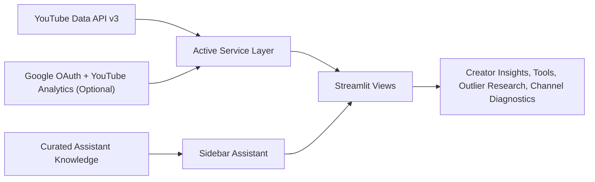
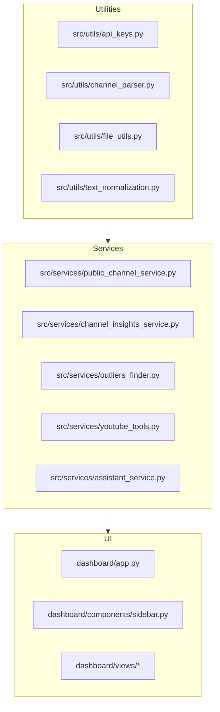

# System Architecture

This repository now follows a runtime-first layout.

## Active Runtime Surface

The deployed Streamlit app is built from:

- `streamlit_app.py`
- `dashboard/`
- `src/services/`
- `src/utils/`
- `src/llm_integration/thumbnail_generator.py`
- `data/youtube api data/`
- `data/assistant/`
- `outputs/assistant/`
- `outputs/channel_insights/`

## Runtime Flow

## Runtime Modules

## Archived Research Material

Historical research assets that are not part of the deployed app now live under:

- `research_archive/src/`
- `research_archive/data/`
- `research_archive/docs/`
- `research_archive/notebooks/`

These materials are preserved for reference, but they are not part of the runtime deployment contract.
