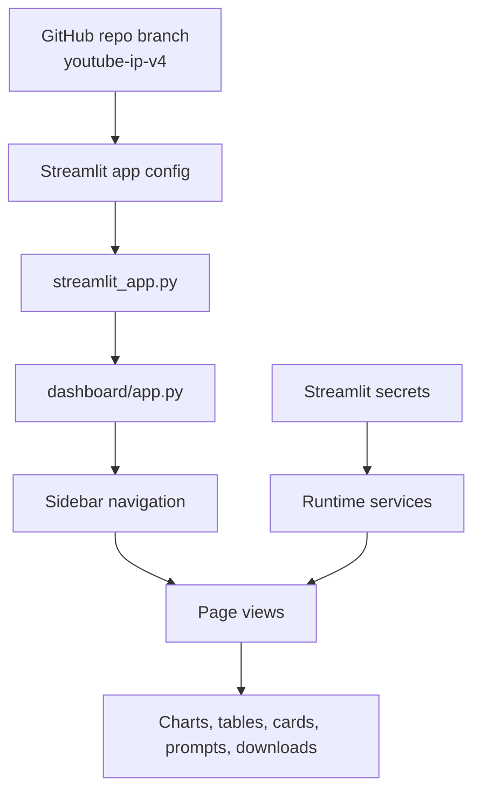
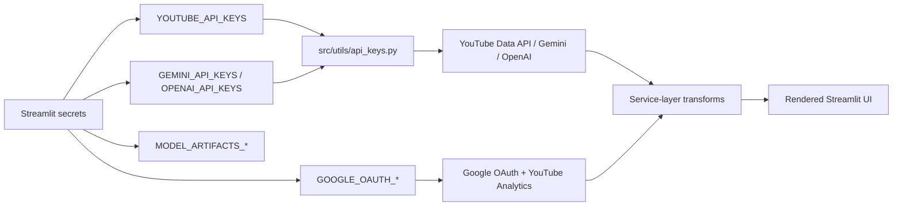
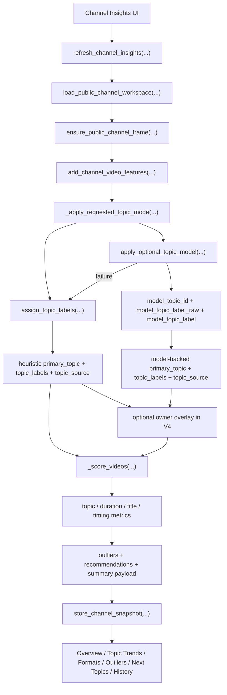
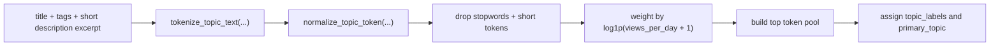

# V4 Deployment, Versions, And Model Flow

## Branch And Repo Targets

| Item | Value |
| --- | --- |
| Original repo branch tag | `youtube-ip-v4` |
| Original repo | `matt-foor/purdue-youtube-ip` |
| Deploy repo | `royayushkr/Youtube-IP-V4` |
| Deploy branch | `main` |
| PR branch reference | [youtube-ip-v4](https://github.com/matt-foor/purdue-youtube-ip/tree/youtube-ip-v4) |

## Navigation Order

1. `Channel Analysis`
2. `Channel Insights`
3. `Recommendations`
4. `Outlier Finder`
5. `Ytuber`
6. `Tools`
7. `Deployment`

This branch also includes the global sidebar `Assistant`.

## Streamlit Deployment Flow



## Secrets And Live API Flow



## Model-Backed Topic Deployment

The deploy-time settings only enable the beta path. The normal `Channel Insights` pipeline still starts with the public workspace and branches inside `_apply_requested_topic_mode(...)`.

### Channel Insights Topic Pipeline



### Topic Mode Explanation

- `Heuristic Topics` = built-in token and rule grouping from title, tags, and a description excerpt
- `Model-Backed Topics` = optional BERTopic semantic grouping loaded from the external artifact path

### Heuristic Topic Derivation



### BERTopic Beta Preprocessing And Artifact Flow

```mermaid
flowchart LR
    A["MODEL_ARTIFACTS_ENABLED"] --> B["beta mode can be requested"]
    C["MODEL_ARTIFACTS_MANIFEST_URL"] --> D["model_artifact_service.py"]
    D --> E["Manifest JSON"]
    E --> F["artifact_url + sha256 + bundle_version"]
    F --> G["download only on explicit beta refresh"]
    G --> H["outputs/models/runtime/<bundle_version>/"]
    H --> I["topic_model_runtime.py"]
    I --> J["build_bertopic_inference_text(...)"]
    J --> K["duplicate title"]
    J --> L["strip boilerplate description"]
    J --> M["normalize tags"]
    K --> N["remove standalone digits"]
    L --> N
    M --> N
    N --> O["bertopic_token_count + is_sparse_text"]
    O --> P["BERTopic transform(...)"]
    P --> Q["model_topic_id + raw label + human label + topic_source"]
    D --> R["fallback to heuristics if artifact is missing or invalid"]
```



### Streamlit Secrets Block

```toml
YOUTUBE_API_KEYS = ["your_youtube_key_1", "your_youtube_key_2"]
GEMINI_API_KEYS = ["your_gemini_key_1", "your_gemini_key_2"]
OPENAI_API_KEYS = ["your_openai_key_1", "your_openai_key_2"]

GOOGLE_OAUTH_CLIENT_ID = "your-google-oauth-client-id"
GOOGLE_OAUTH_CLIENT_SECRET = "your-google-oauth-client-secret"
GOOGLE_OAUTH_REDIRECT_URI = "https://your-app-name.streamlit.app/"

MODEL_ARTIFACTS_ENABLED = true
MODEL_ARTIFACTS_MANIFEST_URL = "https://raw.githubusercontent.com/royayushkr/Youtube-IP-V4/main/data/model_manifests/bertopic_manifest_2026.03.27.json"
MODEL_ARTIFACTS_CACHE_DIR = "outputs/models/runtime"
MODEL_ARTIFACTS_DOWNLOAD_TIMEOUT_SECONDS = 300
MODEL_ARTIFACTS_MAX_SIZE_MB = 512
```

## V4 Vs V5

| Area | V4 (`youtube-ip-v4`) | V5 (`youtube-ip-v5`) |
| --- | --- | --- |
| Sidebar Assistant | Present | Removed |
| Google OAuth | Present | Removed |
| Channel Insights | Public + optional owner overlays | Public-only |
| Page 3 label | `Recommendations` | `Thumbnails` |
| Ytuber | Present | Present |
| Tools | Present | Present |
| Deployment | Present | Present |
| BERTopic beta | Optional | Optional |
